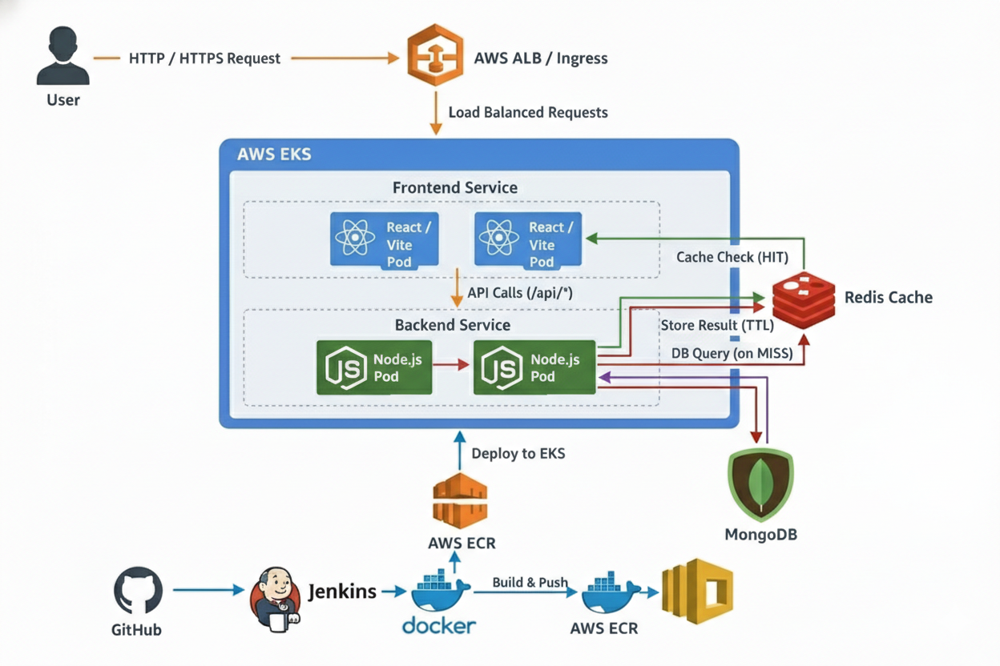

# Real Estate Application

A full-stack cloud-native **Real Estate Platform** built using the **MERN Stack**, deployed on **AWS EKS (Kubernetes)** with an automated **CI/CD pipeline using Jenkins**, **Docker**, **Amazon ECR**, and **Redis caching** for improved API performance.




# Features

* User Authentication (JWT)
* Create, Update & Delete Property Listings
* Property Search with Filters
* Image Upload Support
* Responsive React UI
* AI-powered Real Estate Assistant (MongoDB Search)
* Redis Caching for Read-heavy APIs
* Kubernetes Deployment
* Automated CI/CD using Jenkins
* Dockerized Microservice Deployment
* AWS Cloud Infrastructure

---

# Tech Stack

## Frontend

* React.js
* Vite
* Redux Toolkit
* Tailwind CSS

## Backend

* Node.js
* Express.js
* MongoDB Atlas
* Mongoose
* JWT Authentication
* Firebase Storage
* Redis (ioredis)

## AI

* OpenRouter AI

## DevOps

* Docker
* Jenkins
* Kubernetes
* Amazon EKS
* Amazon ECR
* AWS IAM
* AWS ALB Ingress Controller

---

# CI/CD Pipeline

The project follows an automated deployment pipeline.

```
GitHub
   |
   v
Jenkins
   |
   v
Docker Build
   |
   v
Amazon ECR
   |
   v
Amazon EKS
```

Pipeline stages:

* Checkout Source Code
* Build Backend Image
* Build Frontend Image
* Push Images to Amazon ECR
* Manual Production Approval
* Deploy to Amazon EKS
* Rolling Update Deployment

---

# Redis Caching

Redis is used as a **read-through cache** for frequently accessed property listings.

## Flow

```
Client Request
      |
      v
Backend API
      |
      |-- Redis GET
      |      |
      |      | HIT
      |      +------> Return Cached Data
      |
      | MISS
      v
 MongoDB Atlas
      |
      v
 Redis SET (TTL = 60 seconds)
      |
      v
 Return Response
```

## Cache Strategy

* Read-heavy endpoints are cached.
* Cache TTL: **60 seconds**
* Cache is invalidated after:

  * Property Creation
  * Property Update
  * Property Deletion

Benefits:

* Lower MongoDB load
* Faster API response
* Reduced latency
* Improved scalability

---

# Kubernetes Components

* Namespace
* Deployments
* Services
* ConfigMaps
* Secrets
* Redis Deployment
* Ingress
* Rolling Updates

---

# Project Structure

```
Real-Estate-App
│
├── backend
│   ├── controllers
│   ├── models
│   ├── routes
│   ├── services
│   ├── utils
│   └── index.js
│
├── frontend
│   ├── src
│   ├── components
│   ├── pages
│   └── redux
│
├── k8s
│   ├── backend-deployment.yaml
│   ├── frontend-deployment.yaml
│   ├── redis-deployment.yaml
│   ├── ingress.yaml
│   ├── services
│   └── configmap.yaml
│
├── Jenkinsfile
├── docker-compose.yml
└── README.md
```

---

# Running Locally

## Clone Repository

```bash
git clone https://github.com/sairaj237/Real-Estate-App.git
cd Real-Estate-App
```

## Install Dependencies

```bash
npm install

cd backend
npm install

cd ../frontend
npm install
```

## Environment Variables

Backend `.env`

```
MONGO_URI=
JWT_SECRET=
OPENROUTER_API_KEY=

PINECONE_API_KEY=
PINECONE_ENVIRONMENT=
PINECONE_INDEX=

REDIS_HOST=localhost
REDIS_PORT=6379
```

## Start Application

```bash
npm run dev
```

---

# Docker

Build backend

```bash
docker build -t realestate-backend ./backend
```

Build frontend

```bash
docker build -t realestate-frontend ./frontend
```

---

# Deploy to Kubernetes

```bash
kubectl apply -f k8s/
```

Verify

```bash
kubectl get pods -n real-estate-app
kubectl get svc -n real-estate-app
kubectl get ingress -n real-estate-app
```

---

# AWS Services Used

* Amazon EKS
* Amazon ECR
* IAM Roles
* Application Load Balancer
* EC2
* CloudWatch (optional)
* MongoDB Atlas

---

# Performance Optimizations

* Redis Read Cache
* Kubernetes Rolling Updates
* Docker Multi-stage Builds
* Stateless Backend
* Query Filtering
* Pagination
* Image Caching
* Load Balancing through Kubernetes Services

---

# Future Improvements
* AWS ElastiCache
* Prometheus & Grafana Monitoring
* Helm Charts
* ArgoCD GitOps
* Terraform Infrastructure as Code


## Contributing

1. Fork the repository
2. Create a feature branch
3. Make your changes
4. Test thoroughly
5. Submit a pull request

## License

This project is licensed under the ISC License.